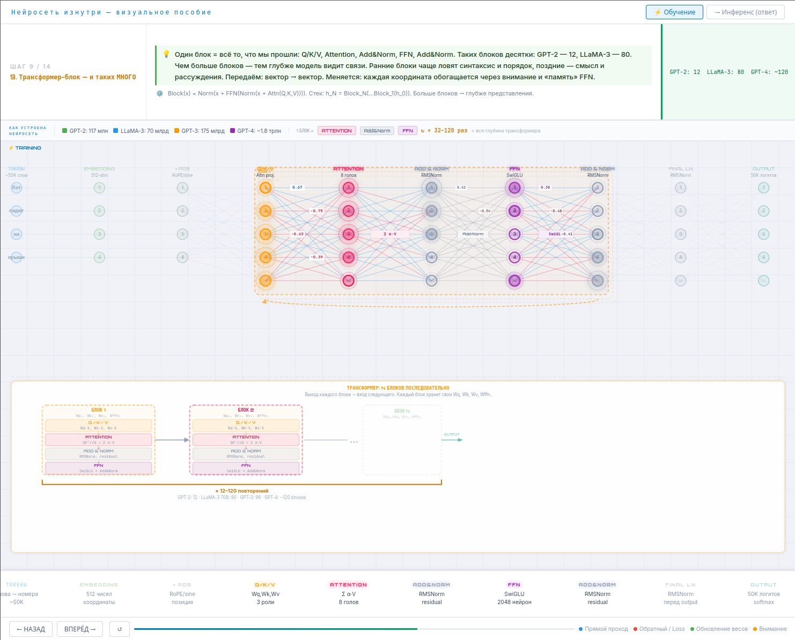

# Нейросеть изнутри — визуальное пособие

Интерактивная страница, которая пошагово показывает, как работает нейросеть-трансформер при обучении и при генерации ответов.

**Демо:** [gost1k.github.io/neural_principe](https://gost1k.github.io/neural_principe/)

---

## Что внутри

- **Режим «Обучение»** — 14 шагов: токенизация, embedding, positional encoding, Q/K/V, attention, Add&Norm, FFN, output, loss, backpropagation, Adam, итерации.
- **Режим «Инференс»** — 9 шагов: как модель генерирует ответ по одному слову, KV-Cache, контекстное окно.

Есть пояснения для новичков и технические комментарии. Архитектура соответствует GPT/LLaMA-подобным моделям (Pre-Norm, SwiGLU, RoPE).

